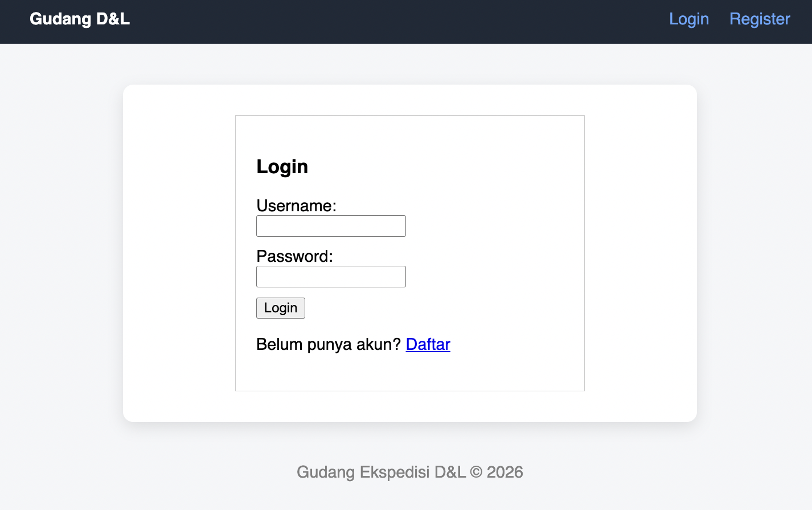

# 📦 Flask CRUD Warehouse App (Gudang D&L)

A simple web-based warehouse management system built using Flask.
This project demonstrates a complete end-to-end workflow: from local development to live deployment.

🔗 **Live Demo**: https://flask-crud-app-918c.onrender.com/
🔗 **Repository**: https://github.com/trishnantidea-sys/flask-crud-app

---

## 📸 Preview



---

## 💭 Why I Built This

This project was created as part of my learning journey in backend development.
I wanted to move beyond local scripts and build a real web application that is accessible online.

Through this project, I learned how to connect everything:
from backend logic, database handling, user interface, all the way to deployment.

---

## 🚀 Features

* 🔐 User registration & login system
* 👤 Session-based authentication
* 📋 Full CRUD functionality (Create, Read, Update, Delete)
* 🎨 Clean and improved UI layout
* ☁️ Deployed and accessible online

---

## 🛠️ Tech Stack

* **Backend**: Python, Flask
* **Database**: SQLite
* **Frontend**: HTML, CSS
* **Deployment**: Render
* **Version Control**: GitHub

---

## 🧩 How It Works

* Flask handles routing and backend logic
* SQLite stores application data
* HTML templates render the UI
* Sessions manage authentication state

---

## 📂 Project Structure

```
flask-crud-app/
│── app.py
│── requirements.txt
│── Procfile
│── templates/
│── static/
│── instance/
```

---

## ⚙️ Installation (Run Locally)

### 1. Clone repository

```bash
git clone https://github.com/trishnantidea-sys/flask-crud-app.git
cd flask-crud-app
```

---

### 2. Create virtual environment

```bash
python -m venv venv
source venv/bin/activate   # Mac/Linux
venv\Scripts\activate      # Windows
```

---

### 3. Install dependencies

```bash
pip install -r requirements.txt
```

---

### 4. Run application

```bash
python app.py
```

App will run on:

```
http://127.0.0.1:5000
```

---

## ☁️ Deployment

This project is deployed using Render.

### Steps:

1. Push project to GitHub
2. Connect repository to Render
3. Configure:

   * **Build Command**: `pip install -r requirements.txt`
   * **Start Command**: `gunicorn app:app`
4. Deploy 🚀

---

## 🧠 Lessons Learned

* Building locally is not enough—deployment is crucial
* Debugging deployment issues is part of real development
* Small UI improvements significantly improve user experience
* End-to-end projects provide deeper understanding

---

## 📌 Future Improvements

* 🔐 Add password hashing for better security
* 🐘 Migrate database to PostgreSQL
* 🎨 Improve UI with modern framework (Bootstrap / Tailwind)
* 📊 Add dashboard analytics

---

## 👤 Author

**Dea Trishnanti**
Data Scienctist

---
